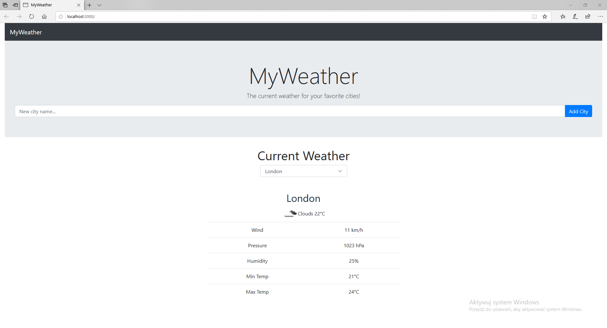

# React-app "MyWeather"
>Alikacja "MyWeather" jest wygodną i szybką opcją na sprawdzenie aktuanych warunków pogodowych w wybranych przez ciebie miastach. Strona podaje wiarygodne i dokładne informacje pogodowe wystarczy tylko wpisać dowolne miasto.

## Table of contents
* [General info](#general-info)
* [Screenshots](#screenshots)
* [Technologies](#technologies)
* [Setup](#setup)
* [Status](#status)
* [Contact](#contact)

## General info
"MyWeather" to aplikacja react-app która korzysta z danych pobranych ze strony openweathermap.org po czym za pośrednictwem bazy danych na postgresie przekazuje je do naszej strony i wyświetla w szybki podgląd aktualnych warunków pogodowych dzięki czemu dużo szybciej możemy znaleść interesujące na informacje na temat aktualnej pogody  

## Screenshots

## Technologies
* JavaScript 
* HTML
* CSS

## Setup
Przed uruchomieniem aplikacji upewnij się że masz zainstalowanego _node.js_ i _Visual Studio Code_. Aby uruchomić aplikacje pogodową należy otworzyć folder o nazwie React-app w programie _Visual Studio Code_ następnie wejść w zakłądkę View i w niej wybrać Terminal, a następnie w terminalu wpisać komendę `npm run dev` co powinno po chwili uruchomić nowe okno w przeglądarce

## Status
Project is: _finished_, _maybe continued in future_ 

## Contact
Created by Krzysztof Karczewski 
e-mail: glenglen553@gmail.com