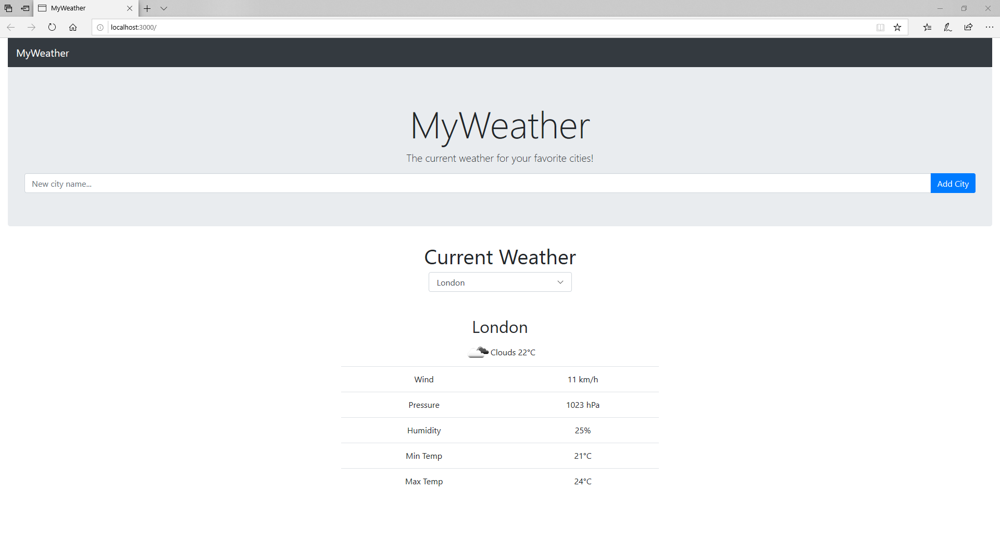

# React-app "MyWeather"
>The "MyWeather" application is a convenient and quick option to check the current weather conditions in selected cities. The site provides reliable and accurate weather information, all you have to do is enter any city.

## Table of contents
* [General info](#general-info)
* [Screenshots](#screenshots)
* [Technologies](#technologies)
* [Setup](#setup)
* [Status](#status)
* [Contact](#contact)

## General info
"MyWeather" is a react-app application that uses data downloaded from the openweathermap.org website and then transmits them to our website via a postgres database and displays a quick preview of current weather conditions so that we can find interesting information about current weather much faster.

## Screenshots

## Technologies
* JavaScript 
* HTML
* CSS

## Setup
Before running the application, make sure you have _node.js_ and _Visual Studio Code_ installed. To start the weather application, open the folder called React-app in the _Visual Studio Code_ program, then go to the View tab and select Terminal in it, then enter the command `npm run dev` in the terminal, which should launch a new window in the browser after a while.

## Status
Project is: _finished_, _maybe continued in future_ 

## Contact
Created by Krzysztof Karczewski 
e-mail: glenglen553@gmail.com